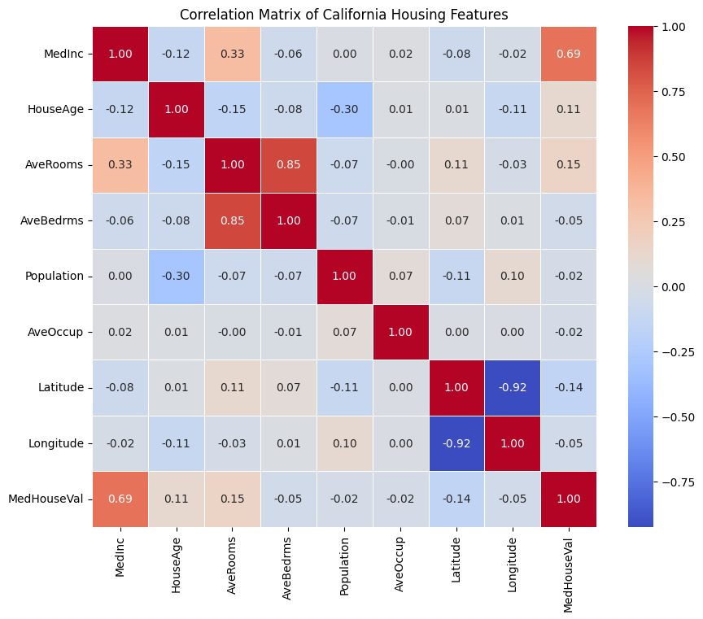
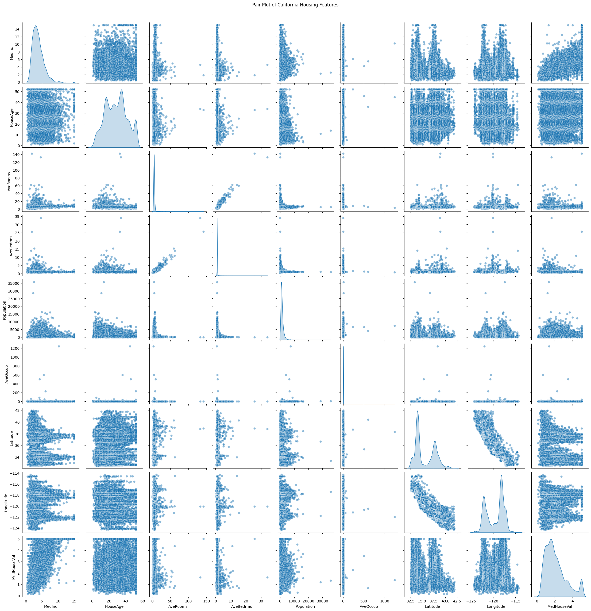

# Correlation Analysis of California Housing Dataset

 This program is to Compute the correlation matrix to understand the relationships between pairs of features. Visualize the correlation matrix using a heatmap to know which variables have strong positive/negative correlations. Create a pair plot to visualize pairwise relationships between features. Use California Housing dataset.

## Features

- Loads the California Housing dataset using scikit-learn
- Computes the correlation matrix for all features
- Visualizes the correlation matrix with a heatmap (using seaborn)
- Creates a pair plot to visualize pairwise feature relationships

## Output

