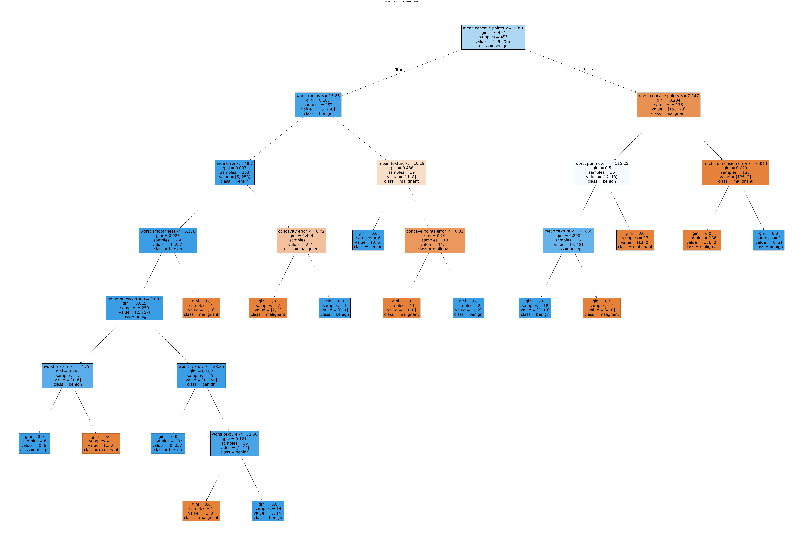

# Decision Tree Classifier Demo - Breast Cancer Dataset

This project demonstrates the use of a Decision Tree Classifier on the Breast Cancer Wisconsin dataset. The script trains a decision tree, evaluates its accuracy, predicts the class of a new sample, and visualizes the decision tree structure.

## Features

- Loads the Breast Cancer dataset using scikit-learn
- Splits the data into training and testing sets
- Trains a Decision Tree Classifier
- Evaluates and prints the model's accuracy
- Predicts the class of a new sample
- Visualizes the trained decision tree

# Output

Model Accuracy: 94.74%

Predicted Class for the new sample: Benign

