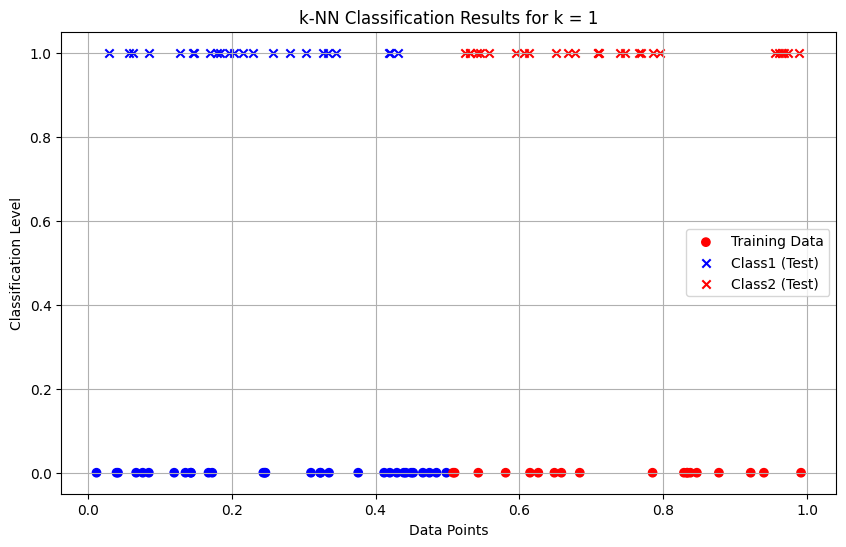
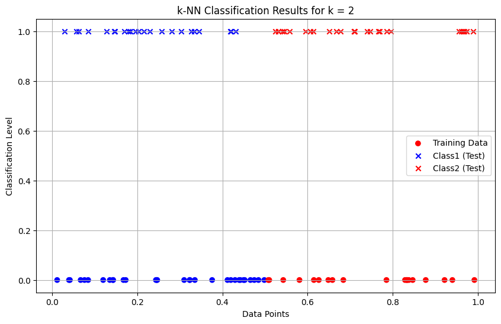

# K-Nearest Neighbour (k-NN) Algorithm - 1D Classification

This program is to implement k-Nearest Neighbour algorithm to classify the randomly generated 100 values of x in the range of [0,1]. Perform the following based on dataset generated.

a) Label the first 50 points {x1,……,x50} as follows: if (xi ≤ 0.5), then xi ∊ Class1, else xi ∊ Class1

b) Classify the remaining points, x51,……,x100 using KNN. Perform this for k=1,2,3,4,5,20,30

## Features

- Generates 100 random 1D data points
- Assigns labels: "Class1" if x ≤ 0.5, "Class2" otherwise (for the first 50 points)
- Uses the first 50 points as the training set, the remaining 50 as the test set
- Implements k-NN classification for multiple k values
- Prints classification results for each test point and k value
- Visualizes training and classified test data for each k using matplotlib

## Output

--- k-Nearest Neighbors Classification ---
Training dataset: First 50 points labeled based on the rule (x <= 0.5 -> Class1, x > 0.5 -> Class2)
Testing dataset: Remaining 50 points to be classified

Results for k = 1:
Point x51 (value: 0.9740) is classified as Class2
Point x52 (value: 0.1462) is classified as Class1
Point x53 (value: 0.9647) is classified as Class2
Point x54 (value: 0.3035) is classified as Class1
Point x55 (value: 0.4193) is classified as Class1
Point x56 (value: 0.1968) is classified as Class1
Point x57 (value: 0.5459) is classified as Class2
Point x58 (value: 0.9555) is classified as Class2
Point x59 (value: 0.5310) is classified as Class2
Point x60 (value: 0.1790) is classified as Class1
Point x61 (value: 0.7659) is classified as Class2
Point x62 (value: 0.5318) is classified as Class2
Point x63 (value: 0.5245) is classified as Class2
Point x64 (value: 0.6138) is classified as Class2
Point x65 (value: 0.2032) is classified as Class1
Point x66 (value: 0.6767) is classified as Class2
Point x67 (value: 0.1482) is classified as Class1
Point x68 (value: 0.7860) is classified as Class2
Point x69 (value: 0.5408) is classified as Class2
Point x70 (value: 0.5581) is classified as Class2
Point x71 (value: 0.3452) is classified as Class1
Point x72 (value: 0.0572) is classified as Class1
Point x73 (value: 0.4313) is classified as Class1
Point x74 (value: 0.7951) is classified as Class2
Point x75 (value: 0.2812) is classified as Class1
Point x76 (value: 0.3273) is classified as Class1
Point x77 (value: 0.1704) is classified as Class1
Point x78 (value: 0.0300) is classified as Class1
Point x79 (value: 0.6674) is classified as Class2
Point x80 (value: 0.9673) is classified as Class2
Point x81 (value: 0.2295) is classified as Class1
Point x82 (value: 0.7692) is classified as Class2
Point x83 (value: 0.1280) is classified as Class1
Point x84 (value: 0.0627) is classified as Class1
Point x85 (value: 0.7090) is classified as Class2
Point x86 (value: 0.1840) is classified as Class1
Point x87 (value: 0.2151) is classified as Class1
Point x88 (value: 0.6507) is classified as Class2
Point x89 (value: 0.6057) is classified as Class2
Point x90 (value: 0.7105) is classified as Class2
Point x91 (value: 0.3346) is classified as Class1
Point x92 (value: 0.7100) is classified as Class2
Point x93 (value: 0.4199) is classified as Class1
Point x94 (value: 0.0849) is classified as Class1
Point x95 (value: 0.9604) is classified as Class2
Point x96 (value: 0.7469) is classified as Class2
Point x97 (value: 0.2576) is classified as Class1
Point x98 (value: 0.7395) is classified as Class2
Point x99 (value: 0.9882) is classified as Class2
Point x100 (value: 0.5947) is classified as Class2

continues this till k=30

continues this image generation till k=30