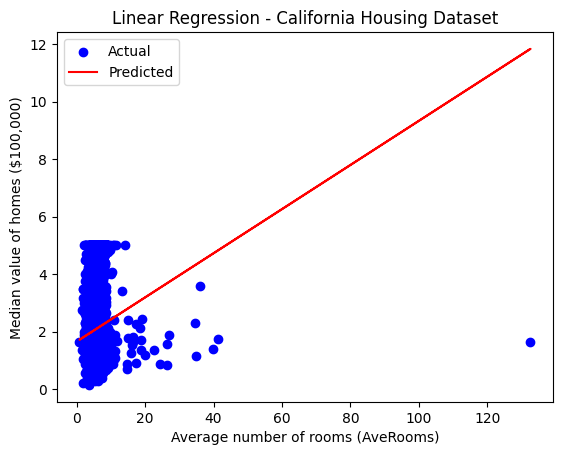
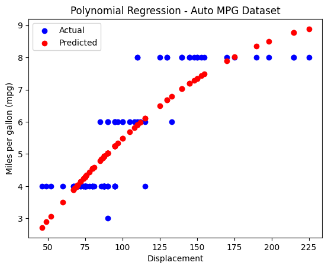

# Linear and Polynomial Regression Demonstration

This project demonstrates the working of Linear Regression and Polynomial Regression using two real-world datasets:

- **Linear Regression:** California Housing Dataset (predicting median house value from average number of rooms)
- **Polynomial Regression:** Auto MPG Dataset (predicting vehicle fuel efficiency from engine displacement)

## Features

- Loads and preprocesses the California Housing and Auto MPG datasets
- Performs Linear Regression on the California Housing dataset
- Performs Polynomial Regression (degree 2) on the Auto MPG dataset
- Visualizes actual vs. predicted values for both regression models
- Prints evaluation metrics: Mean Squared Error (MSE) and R² Score

## Output

Demonstrating Linear Regression and Polynomial Regression

Linear Regression - California Housing Dataset
Mean Squared Error: 1.2923314440807299
R^2 Score: 0.013795337532284901

Polynomial Regression - Auto MPG Dataset
Mean Squared Error: 0.7431490557205861
R^2 Score: 0.7505650609469626