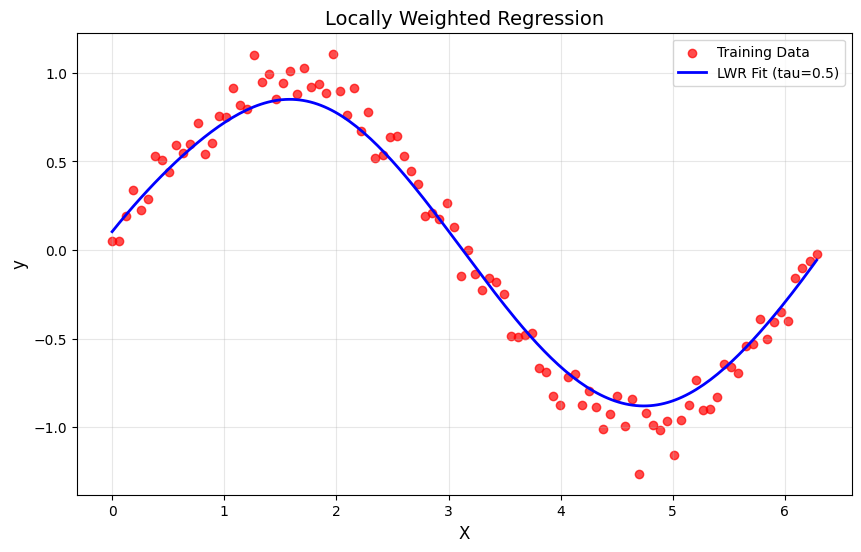

# Locally Weighted Regression (LWR) Implementation

This project demonstrates Locally Weighted Regression (LWR), a non-parametric regression technique that fits a regression model around each query point using a weighted subset of the training data. The script fits a noisy sine curve and visualizes the result.

## Features

- Implements Gaussian kernel for local weighting
- Fits a locally weighted linear regression for each test point
- Visualizes the original data and the LWR fit

## Output

