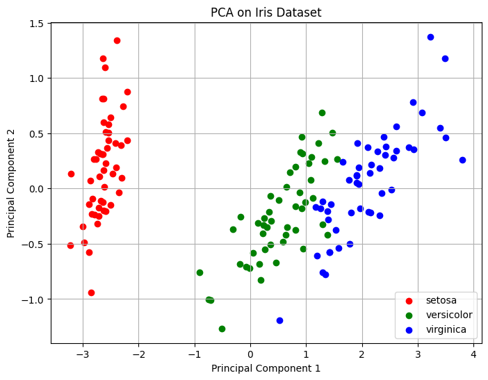

# Principal Component Analysis (PCA) on Iris Dataset

This project demonstrates how to perform Principal Component Analysis (PCA) on the classic Iris dataset. It reduces the dataset from four to two principal components and visualizes the results in a scatter plot, showing how well the classes are separated in the reduced feature space.

## Features

- Loads the Iris dataset using scikit-learn
- Applies PCA to reduce the dataset to 2 dimensions
- Visualizes the reduced data with a scatter plot, colored by class

## Output

